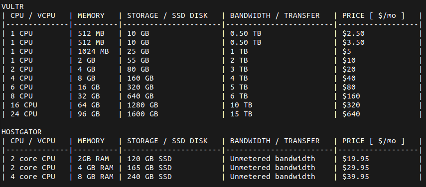
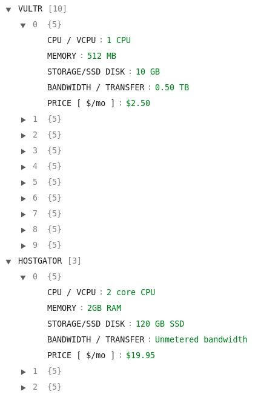
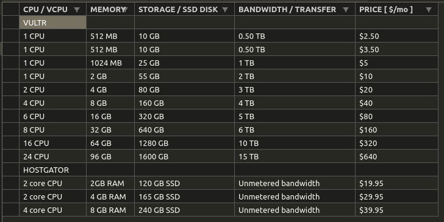

# Desafio Digesto

Este projeto consiste na criação de dois scrapers para realizar a coleta de dados de dois websites, [Vultr](https://www.vultr.com/products/cloud-compute/#pricing) e [HostGator](https://www.hostgator.com/vps-hosting). Assim que o programa for executado, os dois scrapers serão inicializados e os dados coletados poderão dispostos de três formas, na linha de comando, num arquivo `.csv` ou num arquivo `.json`.

*Enunciado do desafio: [Desafio Digesto Backend Python-5.pdf](./Desafio_Digesto_Backend_Python-5.pdf)*

## Pré-requisítos

* `python >= 3.8.10`
* `pip >= 21.2.4 `

## Instalação

Basta abrir um terminal/prompt de comando na raiz do projeto e executar o seguinte comando:

    python3 -m pip install -r requirements.txt --user

## Como usar

Basta abrir um terminal/prompt de comando na raiz do projeto e executar o seguinte comando:

    python3 src/main.py

Assim que o programa for executado, basta interagir entre as opções desejadas.

## Resultados

* Opção 1 - Disposição dos dados via CLI.
    * 

* Opção 2 - Preview do arquivo `.json`, o mesmo pode ser encontrado no diretório [/output/](./output/), ou clicando [aqui](./output/data.json)    
    * 

* Opção 3 - Preview do arquivo `.csv`, o mesmo pode ser encontrado no diretório [/output/](./output/), ou clicando [aqui](./output/data.csv)
    * 

## Comentários e Observações

Inicialmente, o segundo scraper tinha como site alvo [https://www.digitalocean.com/pricing/#droplet](https://www.digitalocean.com/pricing/#droplet), porém, aparentemente o mesmo sofreu algumas alterações na estrutura do código fonte desde a data que este desafio foi proposto pela primeira vez (20/01/2021), e atualmente, para realizar o scrape do mesmo, é necessário a utilização do Selenium, mas um dos requisitos do desafio é não utilizar esse framework. Entrei em contato com o desenvolvedor que me enviou a proposta via email e o mesmo me encaminhou o novo site alvo e disse para utilizar este no lugar da DigitalOcean, que no caso é o HostGator, e dessa forma foi possível continuar o desafio respeitando as regras impostas.

Porém, eu já havia desenvolvido o scraper do DigitalOcean enquanto esperava a resposta do desenvolvedor da Digesto. Para o desenvolvimento do mesmo, foi utilizado o Selenium de forma parcial, apenas para carregar o conteúdo do site. O mesmo foi removido do código principal, mas pode ser conferido no commit [449f5c412de12ee463df1a4c8c82dbefd5d78823](https://github.com/danbailo/digesto-challenge/commit/449f5c412de12ee463df1a4c8c82dbefd5d78823).

---

### Problem solving

Sempre que vou desenvolver um crawler/scraper, procuro encapsular e organizar a estrutura alvo num bloco de código. Essa lógica foi utilizada para implementar os dois scrapers presente neste trabalho. Isso garante que nenhuma informação fora desse bloco será coletada, ou seja, não haverá "sujeira" entre os dados e a forma de manipula-los fica mais fácil.

No scraper do [Vultr](https://www.vultr.com/products/cloud-compute/#pricing), os dados estavam dispostos numa tabela, com isso, eu primeiro isolei a esta tabela, e depois organizei os dados em linhas. 
```python
table = soup.find("div", attrs={"class": "pt__body js-body"})
rows = table.find_all("div", attrs={"class":"pt__row-content"})
```

Com os dados orgazinados, basta desevolver a lógica para realizar a coleta e armazenamento dos dados.
```python
for cel in rows:
    storage, cpu, memory, bandwidth, price_month = cel.find_all("strong")
    self.data["VULTR"].append({
        "CPU / VCPU": cpu.text, 
        "MEMORY": memory.text, 
        "STORAGE/SSD DISK": storage.text, 
        "BANDWIDTH / TRANSFER": bandwidth.text, 
        "PRICE [ $/mo ]": price_month.text})   
```


No scraper do [HostGator](https://www.hostgator.com/vps-hosting) os dados estavam dispostos em cartões, logo, isolei o bloco de código onde os cartões se encontravam e chamei esse objeto de container. Com isso, instanciei um novo objeto para deixar de forma orgazinada os dados informativos do servidor com o preço mensal, pois os mesmos se encontravam em blocos diferentes!
```python
container = soup.find("section", attrs={"class":"pricing-card-container false undefined", "class": "pricing-card-container"})
price_cards = []
for price_card_container in container:
    price_cards.append((price_card_container.find("div", attrs={"class": re.compile("(pricing-card)")}),
                        price_card_container.find("p", attrs={"class":"pricing-card-price"})))
```

No scraper da HostGator foi preciso realizar a limpeza dos dados antes de armazená-los de fato, pois ao realizar a coleta, estes apresentavam caracteres hexadecimais em sua estrutura. Após realizar o tratamento utilizando expressões regulares, os mesmos foram armazenados.
```python
for price_card in price_cards:
    result = price_card[0].find_all("li", attrs={"class":"pricing-card-list-items"})
    if result:
        ram, vcpu, storage, bandwidth = price_card[0].find_all("li", attrs={"class":"pricing-card-list-items"})
        pricing_card_price = rmv_hexadecimal_char(price_card[1].text).split("/")[0]
        self.data["HOSTGATOR"].append({
            "CPU / VCPU": rmv_hexadecimal_char(vcpu.text), 
            "MEMORY": rmv_hexadecimal_char(ram.text), 
            "STORAGE/SSD DISK": rmv_hexadecimal_char(storage.text), 
            "BANDWIDTH / TRANSFER": rmv_hexadecimal_char(bandwidth.text), 
            "PRICE [ $/mo ]": pricing_card_price})
```

Quando os dados estão organizados numa estrutura, a coleta e manipulação dos mesmos fica mais facil. 
Essa foi uma breve explicação da lógica utilizada para o desenvolvimento do projeto.

## Agradecimentos

Obrigado pela oportunidade de mostrar meu trabalho.